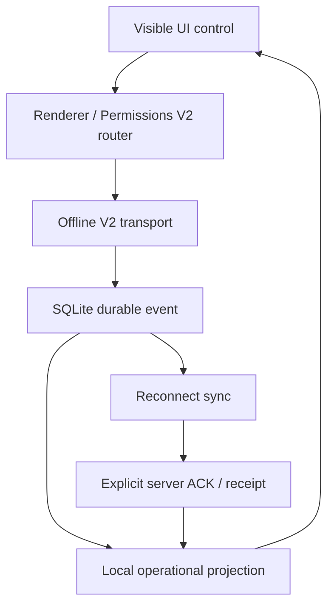

# Sharawla POS — Restaurant RC1 Practical Offline Action Matrix

Recorded: 2026-09-26
Branch: `beta56-offline-ownership-consolidation`
Authoritative starting SHA: `9be6b390fffa931efc501eff8bf2dc3badf04841`
Runtime at starting SHA: `10.5.4-beta.58.29`
Audit target: isolated Beta `SH-0007` / business `تجريبي` only
Production boundary: `SH-0005` / `SH-0006` on `10.5.3 CLEAN` are read-only and excluded.

This is the required **pre-source-change inventory snapshot**. It records the actual Restaurant UI/action surface found in `index.html`, `app.js`, the Beta integration loader, capability-driven injected UIs, Permissions V2 routers, Offline V2 transport/inbox/store, local caches, recovery wrappers, and acceptance gates. A prior automated PASS is cited only for the invariant it actually proves; it is not treated as proof that the visible UI path works offline.

## Classification and verdict vocabulary

| Value | Meaning |
|---|---|
| `OFFLINE_REQUIRED` | Operational action must durably succeed without internet, update local UI/projection, survive restart, and reconcile later by explicit server ACK. |
| `OFFLINE_READ_CACHE` | Screen/action must remain readable and navigable from an identified local cache/projection; stale state must be labelled. |
| `ONLINE_ONLY_FAIL_CLOSED` | Live Cloud/admin action is intentionally Online-only. It must make no partial mutation and show a clear Arabic internet-required message. |
| `NOT_APPLICABLE` | Surface is intentionally outside the Restaurant profile or the RC1 runtime contract. |
| `PASS` | Source path and existing focused evidence prove the stated classification. Hardware-only behavior may still have a separate `MANUAL` row. |
| `FAIL` | Current path violates the classification or has no safe proof. |
| `ONLINE_ONLY_OK` | Intentional Online-only path is explicitly and safely blocked offline. |
| `MANUAL` | Requires SH-0007, printer, OS, or network manipulation that this source environment cannot perform. |

## A. Activation, session, bootstrap, shell, and navigation

| ID | Page / control / action | Classification | Current path and local owner | Pre-fix verdict | Evidence / gap |
|---|---|---|---|---|---|
| A001 | Activation form: submit license key | ONLINE_ONLY_FAIL_CLOSED | `main.js` license IPC → activation API | ONLINE_ONLY_OK | Activation is a Cloud authority operation; no Offline mutation is advertised. |
| A002 | Activation: retry verification | ONLINE_ONLY_FAIL_CLOSED | activation view → license check IPC | ONLINE_ONLY_OK | Requires server verification and remains outside operational grace. |
| A003 | Activation: change license key | ONLINE_ONLY_FAIL_CLOSED | activation UI / main-process license store | ONLINE_ONLY_OK | Administrative rebind is never an Offline operational action. Production rebind is prohibited by this audit. |
| A004 | License grace while internet is absent | OFFLINE_READ_CACHE | main-process cached signed license/grace record | MANUAL | Source has cached grace handling; expiry/boundary behavior needs controlled SH-0007 clock/network validation. |
| A005 | First-time backend setup form | ONLINE_ONLY_FAIL_CLOSED | `setupForm` → local config + server validation | ONLINE_ONLY_OK | First setup is not allowed to pretend it completed Offline. |
| A006 | Login with an already cached valid session | OFFLINE_REQUIRED | auth/session bootstrap → cached bootstrap/LKG | MANUAL | Must be exercised on SH-0007 after a clean online login and real app restart. |
| A007 | Login without any cached valid session | ONLINE_ONLY_FAIL_CLOSED | Supabase password auth | ONLINE_ONLY_OK | Cannot authenticate a new identity Offline; expected explicit failure. |
| A008 | Logout while Offline | OFFLINE_REQUIRED | renderer logout → local session/UI clear | MANUAL | Must clear local authenticated UI without requiring a successful remote sign-out. |
| A009 | Full application restart while Offline | OFFLINE_REQUIRED | Electron startup → runtime snapshot/bootstrap → Offline V2 native DB | MANUAL | Point-15 proves durable queue restart survival, not every visible screen after restart. |
| A010 | Cached bootstrap of business/profile/features | OFFLINE_READ_CACHE | runtime snapshot LKG + `cacheBootstrap()` | PASS | Point-15 anti-rollback/LKG evidence proves accepted signed snapshot use Offline. |
| A011 | Cached branch list and selected branch | OFFLINE_READ_CACHE | bootstrap state/local config | MANUAL | Source fallback exists; visible selector and persistence need device proof. |
| A012 | Branch picker: change selected branch | OFFLINE_REQUIRED | in-memory state + local selected branch | MANUAL | Local navigation action; no Cloud mutation should be needed. |
| A013 | Add branch | ONLINE_ONLY_FAIL_CLOSED | `openCreateBranch()` → Cloud RPC/REST | FAIL | No uniform RPC Offline guard; raw fetch errors can leak. |
| A014 | Manage branches: edit/toggle settings | ONLINE_ONLY_FAIL_CLOSED | `openManageBranches()` → Cloud owner | FAIL | Must be covered by a shared Arabic fail-closed boundary. |
| A015 | Sidebar open/close and page navigation | OFFLINE_REQUIRED | DOM/router only | PASS | Pure local navigation. |
| A016 | Browser/Electron back-like modal close/cancel actions | OFFLINE_REQUIRED | DOM modal removal | PASS | Pure local UI; no persistence expected. |
| A017 | Update center: inspect installed/candidate status | OFFLINE_READ_CACHE | updater IPC/local metadata | MANUAL | Installed/last-good metadata is local; availability is not. |
| A018 | Update center: check/download/install update | ONLINE_ONLY_FAIL_CLOSED | updater IPC/network | ONLINE_ONLY_OK | Internet is inherently required; queue safety remains mandatory before installation. |
| A019 | Roll back to last-good build | NOT_APPLICABLE | updater/last-good IPC | MANUAL | Recovery administration, not Offline restaurant operation; must never touch production in this audit. |
| A020 | Developer contact / WhatsApp | ONLINE_ONLY_FAIL_CLOSED | external URL launcher | ONLINE_ONLY_OK | No business mutation; internet requirement is inherent. |
| A021 | Permission-hidden navigation item | OFFLINE_READ_CACHE | cached Permissions V2/runtime config | PASS | Visibility is derived locally after bootstrap. |
| A022 | Permission-denied action click | OFFLINE_REQUIRED | Permissions V2 router/guards | PASS | Authorization must remain enforced Offline; existing permission owner gates cover registered actions. |
| A023 | Beta self-test / destructive acceptance controls | NOT_APPLICABLE | beta-only acceptance modules | PASS | Not an operator workflow; transactional controls remain sandbox-gated. |

## B. Home dashboard and counters

| ID | Page / control / action | Classification | Current path and local owner | Pre-fix verdict | Evidence / gap |
|---|---|---|---|---|---|
| H001 | Open Home dashboard | OFFLINE_READ_CACHE | `renderHome()` → REST wrapper/cache | FAIL | Network exceptions are swallowed into zero/empty values; stale/offline state is not consistently labelled. |
| H002 | Current open-shift card/counter | OFFLINE_READ_CACHE | `getOpenShift()` recovery + cached shift | PASS | Runtime recovery supplies cached open shift. |
| H003 | Today sales/order counters | OFFLINE_READ_CACHE | orders/returns cache-derived aggregation | FAIL | Native V2 pending sales/returns are not projected into the caches used by the dashboard. |
| H004 | Active delivery counter | OFFLINE_READ_CACHE | direct orders query/recovery baseline | FAIL | Same delivery cache gap as the delivery queue. |
| H005 | Home quick links/cards | OFFLINE_REQUIRED | local router | PASS | Navigation-only controls. |
| H006 | Pending Offline operations indicator | OFFLINE_READ_CACHE | legacy queue badge plus Offline V2 diagnostics | FAIL | The ordinary operator badge is not a single authoritative native-V2 count/status surface. |
| H007 | Stale-data/offline banner | OFFLINE_READ_CACHE | generic recovery toasts/DOM | FAIL | Cached data can be displayed without a durable visible stale timestamp/source message. |

## C. Restaurant POS cart and checkout

| ID | Page / control / action | Classification | Current path and local owner | Pre-fix verdict | Evidence / gap |
|---|---|---|---|---|---|
| P001 | Open POS from cached catalog | OFFLINE_READ_CACHE | bootstrap products/categories/modifiers/variants | PASS | Catalog is part of cached bootstrap. |
| P002 | Switch category / search product | OFFLINE_REQUIRED | local state/filter | PASS | Pure local action. |
| P003 | Add simple product to cart | OFFLINE_REQUIRED | `pushCartItem()` | PASS | Local cart mutation. |
| P004 | Select variant | OFFLINE_REQUIRED | `openItemOptions()` | PASS | Uses cached product variants. |
| P005 | Add modifiers/extras | OFFLINE_REQUIRED | `openItemOptions()` | PASS | Uses cached modifiers/product mappings. |
| P006 | Select removed ingredients | OFFLINE_REQUIRED | `openItemOptions()` | PASS | Local cart metadata. |
| P007 | Add item note | OFFLINE_REQUIRED | `openItemOptions()` | PASS | Local cart metadata. |
| P008 | Offer bundle choices/quantity/note | OFFLINE_REQUIRED | `openOfferOptions()` | PASS | Local configured offer composition. |
| P009 | Increase/decrease cart quantity | OFFLINE_REQUIRED | cart handler/draw | PASS | Local cart mutation. |
| P010 | Weighted/decimal quantity entry | OFFLINE_REQUIRED | weight modal / cart normalization | MANUAL | Restaurant configuration applicability and keyboard behavior need device proof. |
| P011 | Remove cart line | OFFLINE_REQUIRED | local cart handler | PASS | Local cart mutation. |
| P012 | Clear cart | OFFLINE_REQUIRED | local cart state | PASS | Local cart mutation with confirmation. |
| P013 | Change order type dine-in/takeaway/delivery/pickup | OFFLINE_REQUIRED | local checkout state | PASS | No Cloud write until sale commit. |
| P014 | Select table/service context where enabled | OFFLINE_READ_CACHE | cached restaurant/table settings | MANUAL | Table module applicability and cached table occupancy need device proof. |
| P015 | Delivery phone lookup | OFFLINE_READ_CACHE | customer/address cache fallback | FAIL | New/pending V2 customer and address writes are not projected into the cache. |
| P016 | Choose cached customer/address/zone | OFFLINE_REQUIRED | local checkout state | FAIL | Existing cached rows work; newly committed Offline rows can disappear. |
| P017 | Enter manual customer/delivery details | OFFLINE_REQUIRED | local checkout payload | PASS | Captured in local sale event. |
| P018 | Assign cached driver during POS checkout | OFFLINE_REQUIRED | local sale payload | MANUAL | Requires end-to-end delivery sale and later ACK mapping proof. |
| P019 | Apply order-level discount | OFFLINE_REQUIRED | local cart calculation | PASS | Discount is embedded in durable sale payload. |
| P020 | Tax calculation | OFFLINE_REQUIRED | cached business/settings calculation | PASS | Local calculation. |
| P021 | Service fee calculation | OFFLINE_REQUIRED | cached business/settings calculation | PASS | Local calculation. |
| P022 | Apply promo code | ONLINE_ONLY_FAIL_CLOSED | promo validation/active promo state | ONLINE_ONLY_OK | Checkout explicitly blocks active promo Offline; sale can continue after promo cancellation. |
| P023 | Cancel promo | OFFLINE_REQUIRED | local cart promo invalidation | PASS | Local state action. |
| P024 | Cash checkout | OFFLINE_REQUIRED | checkout → sale router → Offline V2 native commit → sync/ACK | FAIL | Durable commit is proven, but official bon continuity and local operational projection are not. |
| P025 | Wallet checkout | OFFLINE_REQUIRED | same sale owner, payment method in payload | FAIL | Same numbering/projection blockers; method-specific device proof still required. |
| P026 | InstaPay checkout | OFFLINE_REQUIRED | same sale owner | FAIL | Same blockers. |
| P027 | Mixed-payment modal validation | OFFLINE_REQUIRED | `openMixedPayment()` local sum validation | PASS | Pure local validation. |
| P028 | Mixed-payment checkout | OFFLINE_REQUIRED | sale owner with payment splits | FAIL | Same numbering/projection blockers; split reconciliation needs focused proof. |
| P029 | Double-click checkout | OFFLINE_REQUIRED | canonical client TX/idempotency owner | PASS | Point-15 same-TX 20× exactly-once proof covers server duplication; visible button state remains in device script. |
| P030 | Lost ACK after sale | OFFLINE_REQUIRED | native outbox → receipt replay → explicit ACK | PASS | Point-15 Deep Chaos evidence. |
| P031 | App closes after local sale before sync | OFFLINE_REQUIRED | SQLite outbox/WAL → restart recovery | PASS | Point-15 crash/restart gate. |
| P032 | Reconnect and sale reconciliation | OFFLINE_REQUIRED | `syncNow()` → server receipt/ACK | PASS | Point-15 proves exactly-once sync, but row/number UI reconciliation is separately FAIL in P033/P038. |
| P033 | Pending sale appears immediately in Orders/Delivery/Home | OFFLINE_REQUIRED | required local projection | FAIL | Native V2 durable event is not reliably inserted into `cachedOrders`/visible projections. |
| P034 | Canonical stock effect for sale | OFFLINE_REQUIRED | Offline V2 inventory effect + server reconciliation | PASS | Point-15 sale→return stock evidence; Canonical Stock remains OFF as required. |
| P035 | Receipt print immediately after Offline sale | OFFLINE_REQUIRED | local sale result → print IPC | MANUAL | Source is local-first; physical printer and content need SH-0007 proof. |
| P036 | Kitchen/prep print immediately after Offline sale | OFFLINE_REQUIRED | local sale result → prep print IPC | MANUAL | Physical printer/routing proof required. |
| P037 | Local printer failure | OFFLINE_REQUIRED | print IPC error/false → toast | MANUAL | Must not roll back or duplicate a committed sale. |
| P038 | Bon/invoice continuity Online → Offline → Online | OFFLINE_REQUIRED | current fallback generators + server allocation | FAIL | Current UI intentionally generates `OFF-*`; no collision-safe official sequence reservation/reconciliation contract exists. |

## D. Orders, invoice detail, reprint, returns, and refunds

| ID | Page / control / action | Classification | Current path and local owner | Pre-fix verdict | Evidence / gap |
|---|---|---|---|---|---|
| O001 | Open Orders list | OFFLINE_READ_CACHE | `renderOrders()` → exact query/cache bundles | FAIL | Previously cached rows work, but native V2 pending sales are missing from the projection. |
| O002 | Date range search / Today | OFFLINE_READ_CACHE | local filter only after query/recovery | FAIL | Cache is query-shaped and incomplete; no reliable all-local dataset. |
| O003 | Orders pagination | OFFLINE_READ_CACHE | query/page cache | FAIL | Exact-query cache dependency can make cached rows disappear by pagination/filter. |
| O004 | Open order details | OFFLINE_READ_CACHE | `openOrderDetails()` → REST then cached bundle | PASS | Explicit cached bundle fallback exists for a previously cached order. |
| O005 | Open pending native V2 order details | OFFLINE_READ_CACHE | required native projection | FAIL | No guaranteed cache bundle is created by current V2 sale result. |
| O006 | Reprint customer receipt | OFFLINE_REQUIRED | cached bundle → local print | MANUAL | Requires SH-0007 printer proof. |
| O007 | Reprint prep receipt | OFFLINE_REQUIRED | cached bundle → local print | MANUAL | Requires SH-0007 printer proof. |
| O008 | Open return from order detail | OFFLINE_REQUIRED | cached order/items → return modal | PASS | Works when bundle exists. |
| O009 | Find sale by bon/invoice on Returns page | OFFLINE_READ_CACHE | cached orders/remote query | FAIL | `OFF-*` and missing native projection break practical lookup. |
| O010 | Full return | OFFLINE_REQUIRED | return router → Offline V2 commit → ACK | FAIL | Durable/stock semantics proven, but local return/order projections and receipt lookup are incomplete. |
| O011 | Partial return quantities | OFFLINE_REQUIRED | return modal payload → same owner | FAIL | Needs local projection, totals, and SH-0007 proof per line. |
| O012 | Refund payment method selection | OFFLINE_REQUIRED | return payload/local result | MANUAL | Durable return exists; cash/wallet/InstaPay/mixed refund display and settlement require focused proof. |
| O013 | Double-submit return | OFFLINE_REQUIRED | canonical TX/idempotent receipt | PASS | Point-15 return replay is stable; UI button state is still in manual script. |
| O014 | Return stock restoration | OFFLINE_REQUIRED | Offline V2 inventory effect/server owner | PASS | Existing sale→return stock restoration proof. |
| O015 | Pending return visible immediately | OFFLINE_REQUIRED | required cached return/order projection | FAIL | Native V2 return is not inserted into `cachedReturns`/order view consistently. |
| O016 | Return receipt print | OFFLINE_REQUIRED | local return result → printer | MANUAL | Device/printer proof required. |
| O017 | Return reconnect/ACK reconciliation | OFFLINE_REQUIRED | native sync/receipt | PASS | Point-15 accepted return ACK/replay. |
| O018 | Cancelled/void order status display | OFFLINE_READ_CACHE | cached order status | MANUAL | Status semantics and stale label need device proof. |

## E. Customers and delivery lookup

| ID | Page / control / action | Classification | Current path and local owner | Pre-fix verdict | Evidence / gap |
|---|---|---|---|---|---|
| C001 | Open Customers list | OFFLINE_READ_CACHE | `renderCustomers()` → REST/cache | PASS | Existing cached customer list fallback exists. |
| C002 | Search cached customers | OFFLINE_REQUIRED | local/filter + cached list | PASS | Pure local once list is present. |
| C003 | Create customer manually | OFFLINE_REQUIRED | Permissions V2 customer router → `commitRpc(customer_create)` | FAIL | Durable local success can reject to caller as `TypeError: Failed to fetch`; UI reports failure. Confirmed on SH-0007. |
| C004 | Newly created Offline customer appears immediately | OFFLINE_REQUIRED | required customer cache projection | FAIL | V2 commit does not update `customersCache`. |
| C005 | Update customer | OFFLINE_REQUIRED | customer update owner → Offline V2 | FAIL | Same deferred-network exception and missing cache projection. |
| C006 | Open customer addresses | OFFLINE_READ_CACHE | `openCustomerAddresses()` direct REST | FAIL | No explicit cached fallback; direct reload can make modal unusable Offline. |
| C007 | Add address | OFFLINE_REQUIRED | address save owner → Offline V2 | FAIL | Durable owner exists, but caller can show network failure and no local address projection. |
| C008 | Edit address | OFFLINE_REQUIRED | address save owner → Offline V2 | FAIL | Same gap. |
| C009 | Delete address | OFFLINE_REQUIRED | address delete owner → Offline V2 | FAIL | Same gap; local tombstone projection missing. |
| C010 | Default/cached address visible in POS phone lookup | OFFLINE_READ_CACHE | POS cache lookup | FAIL | Pending address mutations are not projected. |
| C011 | Customer dependency chain create → address → sale | OFFLINE_REQUIRED | Offline V2 dependency IDs/ACK mapping | PASS | Point-15 targeted customer/address dependency replay was accepted at transport/server level. |
| C012 | Import customers from file | ONLINE_ONLY_FAIL_CLOSED | bulk UI loops customer owner/file parse | FAIL | Current loop can partially durably commit then surface deferred network error; bulk import must be explicitly Online-only or transactionally local-owned. |
| C013 | Customer duplicate-click create/update | OFFLINE_REQUIRED | canonical operation IDs | MANUAL | Needs visible UI and projection proof despite server idempotency. |
| C014 | Customer reconnect/ACK mapping | OFFLINE_REQUIRED | native sync/receipt/dependency map | PASS | Existing focused Point-15 proof. |

## F. Delivery and pickup operations

| ID | Page / control / action | Classification | Current path and local owner | Pre-fix verdict | Evidence / gap |
|---|---|---|---|---|---|
| D001 | Open delivery/pickup queue | OFFLINE_READ_CACHE | `renderDeliveryOrders()` direct orders + drivers REST | FAIL | Confirmed SH-0007 defect: screen disappears/fails because no explicit complete local queue projection. |
| D002 | Queue status filters | OFFLINE_REQUIRED | local filter after load | FAIL | Local logic is fine, but source dataset is unavailable/incomplete Offline. |
| D003 | Queue text search | OFFLINE_REQUIRED | local filter | FAIL | Same dataset blocker. |
| D004 | Open cached delivery order detail/items | OFFLINE_READ_CACHE | `openDeliveryOrderDetails()` direct REST | FAIL | No explicit cached bundle fallback in this path. |
| D005 | Pending Offline delivery sale appears in queue/detail | OFFLINE_REQUIRED | required local sale projection | FAIL | Native sale result is not guaranteed in cached delivery projection. |
| D006 | New → preparing | OFFLINE_REQUIRED | order fulfillment router → Offline V2 order_status | FAIL | Owner is durable, but screen/cache refresh can remove the row or show stale status. |
| D007 | Preparing → ready | OFFLINE_REQUIRED | same | FAIL | Same projection/UI issue. |
| D008 | Ready pickup → completed | OFFLINE_REQUIRED | same | FAIL | Same projection/UI issue. |
| D009 | Ready delivery → assign driver | OFFLINE_REQUIRED | approved driver assignment Offline V2 owner | FAIL | `openDriverPicker()` explicitly blocks whenever `navigator.onLine === false`, overriding the newer owner. |
| D010 | Out-for-delivery → delivered | OFFLINE_REQUIRED | delivery completion wrapper → Offline V2 order_status | FAIL | Transport/settlement semantics are proven, but queue/detail projection and device UX are not. |
| D011 | Select final payment on delivery | OFFLINE_REQUIRED | delivery completion modal/payload | MANUAL | Must prove cash/wallet/InstaPay selection is durably included and displayed. |
| D012 | Delivery payment change after completion | ONLINE_ONLY_FAIL_CLOSED | delivery payment correction RPC | ONLINE_ONLY_OK | Financial correction intentionally requires Cloud authority. |
| D013 | Confirm/reject website payment evidence | ONLINE_ONLY_FAIL_CLOSED | website payment review RPC/storage | FAIL | Direct network calls can surface generic errors; needs explicit Arabic fail-closed UX. |
| D014 | View uploaded payment receipt | ONLINE_ONLY_FAIL_CLOSED | authenticated storage fetch | FAIL | Current error is generic `تعذر تحميل الإيصال`, not an explicit Offline contract. |
| D015 | Driver cash custody view | OFFLINE_READ_CACHE | delivery settlement/shift queries | FAIL | No complete native-V2 local custody projection. |
| D016 | Settle one driver order | ONLINE_ONLY_FAIL_CLOSED | settlement RPC | ONLINE_ONLY_OK | Financial settlement intentionally Online-only. |
| D017 | Settle all driver custody | ONLINE_ONLY_FAIL_CLOSED | settlement RPC | ONLINE_ONLY_OK | Financial settlement intentionally Online-only. |
| D018 | Reconnect order-status/driver assignment replay | OFFLINE_REQUIRED | native sync/explicit ACK | PASS | Point-15 Seq343/353/354 proof covers owner-level replay and exactly-once. |
| D019 | Duplicate delivery transition/driver assignment click | OFFLINE_REQUIRED | native idempotency | MANUAL | Owner evidence exists; visible button disable/projection needs device proof. |
| D020 | Delivery settings: cached drivers/zones list | OFFLINE_READ_CACHE | runtime recovery warmed caches | PASS | Drivers/zones are warmed and beta55-5 marks read-cache. |
| D021 | Add/edit/deactivate driver | ONLINE_ONLY_FAIL_CLOSED | delivery settings owner | ONLINE_ONLY_OK | beta55-5 explicitly guards offline settings mutations. |
| D022 | Add/edit/toggle delivery zone | ONLINE_ONLY_FAIL_CLOSED | delivery settings owner | ONLINE_ONLY_OK | beta55-5 explicitly guards offline settings mutations. |

## G. Kitchen and prep workflow

| ID | Page / control / action | Classification | Current path and local owner | Pre-fix verdict | Evidence / gap |
|---|---|---|---|---|---|
| K001 | Open kitchen queue | OFFLINE_READ_CACHE | `renderKitchen()` direct orders/items REST | FAIL | Generic REST recovery is query-shaped and native V2 pending orders are not projected. |
| K002 | Kitchen order items/notes | OFFLINE_READ_CACHE | order_items query/cache | FAIL | No reliable local bundle for new Offline sales. |
| K003 | Start preparing | OFFLINE_REQUIRED | Permissions V2 fulfillment owner → Offline V2 status | FAIL | Durable owner exists; screen projection/refresh is incomplete. |
| K004 | Mark ready | OFFLINE_REQUIRED | same | FAIL | Same gap. |
| K005 | Complete applicable local/pickup order | OFFLINE_REQUIRED | same | FAIL | Same gap. |
| K006 | Repeated status click/replay | OFFLINE_REQUIRED | idempotent order_status receipt | PASS | Point-15 status replay proof at owner level. |

## H. Shifts, expenses, treasury-facing totals

| ID | Page / control / action | Classification | Current path and local owner | Pre-fix verdict | Evidence / gap |
|---|---|---|---|---|---|
| S001 | Open Shifts page/history | OFFLINE_READ_CACHE | cached shift history + cached open shift | PASS | Explicit fallback exists. |
| S002 | Open shift | OFFLINE_REQUIRED | shift_open owner → native commit/ACK | PASS | Final Point-15 focused runtime proves explicit ACK and stable replay. |
| S003 | Double-submit open shift | OFFLINE_REQUIRED | idempotent owner/guard | PASS | Focused shift lifecycle and server receipt prove one applied shift. |
| S004 | Close shift | OFFLINE_REQUIRED | shift_close owner → native commit/ACK | PASS | Final Point-15 focused runtime proof. |
| S005 | Close shift cash input/reconciliation | OFFLINE_REQUIRED | local metrics + shift_close payload | FAIL | Native V2 pending sale/expense/return projections are omitted from local metrics, risking wrong expected cash. |
| S006 | Close then reopen/new shift while Offline | OFFLINE_REQUIRED | cached shift projection + owners | MANUAL | Needs sequential SH-0007 validation and later server reconciliation. |
| S007 | Current shift sales/order/payment totals | OFFLINE_READ_CACHE | `shiftMetrics()` REST recovery/baseline | FAIL | Baseline reads legacy/cache rows, not every native V2 outbox operation. |
| S008 | Shift report detail | OFFLINE_READ_CACHE | `shiftMetrics()` + `shiftReportData()` | FAIL | Same projection omission; can understate Offline activity. |
| S009 | Print shift report | OFFLINE_REQUIRED | local HTML → print | MANUAL | Requires correct local totals first and printer proof. |
| S010 | Open Expenses page/list | OFFLINE_READ_CACHE | warmed query cache + baseline | FAIL | Newly committed native V2 expense is not guaranteed in visible list. |
| S011 | Create expense | OFFLINE_REQUIRED | expense owner → native commit/ACK | FAIL | Durable owner proof exists, but immediate visible projection and shift metrics are incomplete. |
| S012 | Duplicate expense submit/replay | OFFLINE_REQUIRED | idempotent receipt | PASS | Point-15 expense Seq344 replay proof. |
| S013 | Edit expense | ONLINE_ONLY_FAIL_CLOSED | `expense_update_v2` RPC | ONLINE_ONLY_OK | beta55 contract intentionally excludes Offline update. |
| S014 | Expense date filters | OFFLINE_READ_CACHE | list query/local filter | FAIL | Cache completeness/projection gap. |
| S015 | Treasury page/read | ONLINE_ONLY_FAIL_CLOSED | shared-core direct RPC/query | FAIL | No complete local treasury contract; generic network errors can leak. |
| S016 | Treasury post | ONLINE_ONLY_FAIL_CLOSED | treasury RPC | FAIL | Must be explicitly fail-closed Offline. |

## I. Reports

| ID | Page / control / action | Classification | Current path and local owner | Pre-fix verdict | Evidence / gap |
|---|---|---|---|---|---|
| R001 | Open Reports shell and choose report | OFFLINE_REQUIRED | local page controls | PASS | Local navigation/form action. |
| R002 | Current-shift operational summary | OFFLINE_READ_CACHE | local orders/returns/expenses projections | FAIL | Native V2 projection omissions make totals incomplete. |
| R003 | Sales report for cached period | OFFLINE_READ_CACHE | query cache/REST recovery | FAIL | Exact-query cache is not a defined complete local reporting dataset. |
| R004 | Product/category/payment reports for cached period | OFFLINE_READ_CACHE | cached orders/items aggregation | FAIL | Same completeness/stale-labelling gap. |
| R005 | Returns/expenses cached reports | OFFLINE_READ_CACHE | cached return/expense rows | FAIL | Native V2 pending writes are not projected. |
| R006 | Delivery/driver report | OFFLINE_READ_CACHE | cached delivery rows/custody queries | FAIL | Delivery cache is incomplete. |
| R007 | Historical/live Cloud report outside cached data | ONLINE_ONLY_FAIL_CLOSED | REST/RPC | FAIL | Must clearly state internet is required instead of partial/empty results. |
| R008 | Export current rendered report to CSV | OFFLINE_REQUIRED | renderer Blob/download | MANUAL | Local operation; needs device filesystem proof. |
| R009 | Print current rendered report | OFFLINE_REQUIRED | local print | MANUAL | Requires device/printer proof. |
| R010 | Report date/filter form submit | OFFLINE_REQUIRED | local validation then selected report owner | PASS | Form itself is local; selected report classification controls execution. |

## J. Inventory, purchasing, suppliers, transfers, counts, waste, and recipes

| ID | Page / control / action | Classification | Current path and local owner | Pre-fix verdict | Evidence / gap |
|---|---|---|---|---|---|
| I001 | Inventory overview from last loaded data | OFFLINE_READ_CACHE | `inventory-overview-v1.js` direct REST | FAIL | No explicit coherent snapshot/stale label for Restaurant inventory overview. |
| I002 | Automatic stock effect of Offline sale | OFFLINE_REQUIRED | Offline V2 inventory effect | PASS | Accepted Point-15 stock reconciliation proof. |
| I003 | Automatic stock restore of Offline return | OFFLINE_REQUIRED | Offline V2 inventory effect | PASS | Accepted Point-15 stock restoration proof. |
| I004 | Manual product/ingredient stock adjustment | ONLINE_ONLY_FAIL_CLOSED | inventory/food stock RPC | FAIL | No registered Offline owner; direct RPC can leak network error. |
| I005 | Supplier list/history | ONLINE_ONLY_FAIL_CLOSED | shared inventory/purchasing REST | FAIL | No complete local purchasing snapshot contract. |
| I006 | Create/edit/deactivate supplier | ONLINE_ONLY_FAIL_CLOSED | supplier RPC/REST | FAIL | Must fail closed before mutation. |
| I007 | Purchase draft/order create/edit | ONLINE_ONLY_FAIL_CLOSED | advanced purchasing RPCs | FAIL | No Offline durable purchasing owner. |
| I008 | Purchase receive/approve/post/cancel | ONLINE_ONLY_FAIL_CLOSED | purchasing RPCs | FAIL | Inventory-critical Cloud workflow; must never partially mutate Offline. |
| I009 | Purchase return/debit/landed-cost actions | ONLINE_ONLY_FAIL_CLOSED | purchasing RPCs | FAIL | No Offline contract. |
| I010 | Purchase attachment archive search/view | ONLINE_ONLY_FAIL_CLOSED | Cloud RPC + storage | FAIL | Live Cloud/storage required; current catches may show empty/generic failure. |
| I011 | Upload/delete purchase attachment | ONLINE_ONLY_FAIL_CLOSED | Cloud RPC + object storage | FAIL | Must preflight internet and avoid partial upload/metadata state. |
| I012 | Stock count create/count/post/close | ONLINE_ONLY_FAIL_CLOSED | count RPCs | FAIL | No Offline owner; posting is inventory-critical. |
| I013 | Transfer create/send/receive/cancel | ONLINE_ONLY_FAIL_CLOSED | transfer RPCs | FAIL | No Offline owner. |
| I014 | Internal supply request/issue/receive | ONLINE_ONLY_FAIL_CLOSED | shared-core/restaurant closure RPCs | FAIL | No Offline owner. |
| I015 | Waste/spoilage create/approve | ONLINE_ONLY_FAIL_CLOSED | food operations RPCs | FAIL | No Offline owner. |
| I016 | Ingredients list/stock/cost from last load | ONLINE_ONLY_FAIL_CLOSED | recipe UI loads multiple live tables | FAIL | No defined atomic cache; fail closed is safer than presenting incomplete inventory. |
| I017 | Ingredient create/edit/conversion | ONLINE_ONLY_FAIL_CLOSED | food RPCs | FAIL | Configuration/stock-critical; no Offline owner. |
| I018 | Recipe draft/create/edit/activate | ONLINE_ONLY_FAIL_CLOSED | food recipe RPCs | FAIL | No Offline owner; version activation must be Cloud-authoritative. |
| I019 | Recipe/waste/production advanced operations | ONLINE_ONLY_FAIL_CLOSED | food advanced RPCs | FAIL | No Offline owner. |
| I020 | Central warehouse pages/actions | NOT_APPLICABLE | capability/profile-driven warehouse UI | PASS | Outside Restaurant SH-0007 operational contract unless explicitly enabled in a future profile contract. |
| I021 | Canonical Stock toggle/cutover actions | NOT_APPLICABLE | admin/cutover tooling | PASS | Canonical Stock and Cutover must remain OFF. |

## K. Website and online orders

| ID | Page / control / action | Classification | Current path and local owner | Pre-fix verdict | Evidence / gap |
|---|---|---|---|---|---|
| W001 | Open Online Orders page while Offline | ONLINE_ONLY_FAIL_CLOSED | `renderOnlineOrders()` live website/order queries | FAIL | Errors are caught as empty arrays, misleading the operator that there are no orders. |
| W002 | Search/filter/paginate live website orders | ONLINE_ONLY_FAIL_CLOSED | live queries | FAIL | Must show a persistent Arabic internet-required state. |
| W003 | Open website order detail/address | ONLINE_ONLY_FAIL_CLOSED | live order/customer/address queries | FAIL | Current direct calls can show generic errors. |
| W004 | Accept website order | ONLINE_ONLY_FAIL_CLOSED | Cloud accept/convert RPC | FAIL | Must preflight connectivity before any partial change. |
| W005 | Reject website order | ONLINE_ONLY_FAIL_CLOSED | Cloud reject RPC | FAIL | Same. |
| W006 | Confirm/reject/unpaid payment evidence | ONLINE_ONLY_FAIL_CLOSED | Cloud payment review | FAIL | Same. |
| W007 | Website management hub read | ONLINE_ONLY_FAIL_CLOSED | live settings/products | FAIL | Live website state has no complete cache contract. |
| W008 | Website availability/product toggle | ONLINE_ONLY_FAIL_CLOSED | Cloud product update | FAIL | Must fail closed explicitly. |
| W009 | Website branch settings/hours | ONLINE_ONLY_FAIL_CLOSED | Cloud settings RPC/REST | FAIL | Must fail closed explicitly. |
| W010 | Website payment configuration | ONLINE_ONLY_FAIL_CLOSED | Cloud settings/storage | FAIL | Must fail closed explicitly. |
| W011 | Website appearance/logo/image upload/remove | ONLINE_ONLY_FAIL_CLOSED | Cloud storage/settings | FAIL | Must preflight internet; avoid partial object/config writes. |

## L. Products, promos, users, permissions, settings, HR, and admin

| ID | Page / control / action | Classification | Current path and local owner | Pre-fix verdict | Evidence / gap |
|---|---|---|---|---|---|
| M001 | Products/categories/modifiers list from bootstrap | OFFLINE_READ_CACHE | catalog bootstrap/cache | PASS | beta55-5 declares Product management read-cache. |
| M002 | Create/edit/toggle/sort category | ONLINE_ONLY_FAIL_CLOSED | REST/RPC catalog writes | FAIL | Some beta55-5 selectors are guarded, but coverage is not exhaustive. |
| M003 | Create/edit/toggle/sort product | ONLINE_ONLY_FAIL_CLOSED | REST/RPC catalog writes | FAIL | Must be uniformly guarded. |
| M004 | Product options/modifier mapping/removals | ONLINE_ONLY_FAIL_CLOSED | multi-step REST writes | FAIL | Partial-write risk if the network drops between delete/insert/update. |
| M005 | Product image upload/remove | ONLINE_ONLY_FAIL_CLOSED | storage + product REST update | FAIL | Partial object/row risk and generic errors. |
| M006 | Create/edit/toggle modifier | ONLINE_ONLY_FAIL_CLOSED | REST writes | FAIL | No Offline owner. |
| M007 | Promo list/read | ONLINE_ONLY_FAIL_CLOSED | live promo query | FAIL | No explicit reliable cache contract. |
| M008 | Promo create/edit/toggle/delete | ONLINE_ONLY_FAIL_CLOSED | Cloud mutations | FAIL | Must fail closed explicitly. |
| M009 | Users list/permissions | ONLINE_ONLY_FAIL_CLOSED | employees/permissions live queries | FAIL | Security state must be Cloud-authoritative, not stale-editable. |
| M010 | Create/edit/activate/deactivate user | ONLINE_ONLY_FAIL_CLOSED | Cloud REST/function | FAIL | Direct calls can leak generic network failures. |
| M011 | Change another user's password | ONLINE_ONLY_FAIL_CLOSED | server function | FAIL | Must show explicit internet-required message. |
| M012 | Business identity/financial/settings save | ONLINE_ONLY_FAIL_CLOSED | settings RPC/REST | FAIL | No Offline configuration owner. |
| M013 | Printer profile/settings saved locally | OFFLINE_REQUIRED | local Electron/config IPC where applicable | MANUAL | Must distinguish local printer config from Cloud business config on SH-0007. |
| M014 | Test print | OFFLINE_REQUIRED | local printer IPC | MANUAL | Hardware proof required. |
| M015 | Backup/export local Offline DB | OFFLINE_REQUIRED | native Offline store backup IPC | MANUAL | Existing acceptance proves safe copy operations; operator UI needs device proof. |
| M016 | Restore/reset/delete Offline evidence | NOT_APPLICABLE | recovery/admin tools | PASS | Destructive cleanup is prohibited; Seq293/304/316 must remain untouched. |
| M017 | Employee list/details/statement | ONLINE_ONLY_FAIL_CLOSED | shared-core live queries | FAIL | No complete local HR cache contract. |
| M018 | Employee create/edit/salary | ONLINE_ONLY_FAIL_CLOSED | HR RPCs | FAIL | No Offline owner. |
| M019 | Advance create/approve/reject/disburse | ONLINE_ONLY_FAIL_CLOSED | HR RPCs | FAIL | Financial/admin Cloud workflow. |
| M020 | Adjustment create | ONLINE_ONLY_FAIL_CLOSED | HR RPC | FAIL | No Offline owner. |
| M021 | Payroll run/approve/pay | ONLINE_ONLY_FAIL_CLOSED | payroll RPCs | FAIL | Must fail closed before mutation. |
| M022 | Tables CRUD/occupancy administration where present | ONLINE_ONLY_FAIL_CLOSED | restaurant closure RPCs | FAIL | No durable Offline table-management contract located. |

## M. Background and adverse-network behavior

| ID | Automatic action / network condition | Classification | Current path and local owner | Pre-fix verdict | Evidence / gap |
|---|---|---|---|---|---|
| B001 | Browser `online` event triggers sync | OFFLINE_REQUIRED | Offline V2 transport `syncNow()` | PASS | Registered in transport; explicit ACK required before Synced. |
| B002 | Periodic/automatic inbox pull | OFFLINE_READ_CACHE | Offline V2 inbox watcher | PASS | Pull is best-effort and does not mutate local pending state on fetch failure. |
| B003 | Runtime cache warm on login/reconnect | OFFLINE_READ_CACHE | beta55-4 recovery | FAIL | Warm set omits operational orders/delivery bundles and native outbox projections. |
| B004 | Session refresh while Offline | OFFLINE_REQUIRED | cached session/recovery wrappers | MANUAL | Must not force logout during valid grace; device proof required. |
| B005 | Fully Offline before clicking action | OFFLINE_REQUIRED | `navigator.onLine` + fetch failure + owners | FAIL | Driver assignment and several direct loaders override approved owners/caches. |
| B006 | DNS/fetch failure while `navigator.onLine` remains true | OFFLINE_REQUIRED | network-error classification | FAIL | Direct RPC/fetch UI paths still leak `Failed to fetch` or render empty. |
| B007 | HTTP 5xx during sync | OFFLINE_REQUIRED | retryable transport classification | PASS | Point-15 focused HTTP 503 run proved retry then exactly-once ACK. |
| B008 | Temporary reconnect/flapping | OFFLINE_REQUIRED | sync lock/backoff/native states | PASS | Point-15 retry/ACK/lost-ACK evidence covers owner invariants; UI stability remains in manual script. |
| B009 | Lost server ACK | OFFLINE_REQUIRED | receipt replay/idempotency | PASS | Deep Chaos accepted. |
| B010 | App restart with pending operations | OFFLINE_REQUIRED | SQLite/WAL + takeover startup | PASS | Crash/restart gate accepted. |
| B011 | Duplicate click / repeated retry | OFFLINE_REQUIRED | canonical TX, unique event, server receipt | PASS | Exactly-once gates accepted for registered owners. |
| B012 | Stale cached screen messaging | OFFLINE_READ_CACHE | recovery wrappers/UI | FAIL | No uniform visible timestamp/source banner. |
| B013 | Durable local success returned to UI | OFFLINE_REQUIRED | transport deferred result → caller | FAIL | Customer and similar direct commit owners can surface `Failed to fetch` after durable commit. |
| B014 | Durable write updates local projection | OFFLINE_REQUIRED | native store → operational caches | FAIL | Missing for sale, return, expense, customer/address, and status paths. |
| B015 | Sync explicit ACK and server receipt | OFFLINE_REQUIRED | transport/server receipts | PASS | Point-15 closure evidence. |
| B016 | ACK reconciliation refreshes visible row/official identifiers | OFFLINE_REQUIRED | transport reconcile → UI cache | FAIL | No complete entity mapping/projection update after sale ACK. |
| B017 | Terminal conflict/DLQ preservation | OFFLINE_REQUIRED | native recovery guard | PASS | Historical Seq293/304/316 are preserved and excluded from cleanup. |
| B018 | Automatic destructive cleanup/reset | NOT_APPLICABLE | none permitted | PASS | Explicitly prohibited by audit boundary. |

## N. Restaurant-profile exclusions

| ID | Surface | Classification | Pre-fix verdict | Reason |
|---|---|---|---|---|
| N001 | Retail weight/barcode settings | NOT_APPLICABLE | PASS | Retail-only profile surface. |
| N002 | Retail offers/hold-resume/retail website orders | NOT_APPLICABLE | PASS | Retail-only contract. |
| N003 | Pharmacy batches/prescriptions/expiry workflows | NOT_APPLICABLE | PASS | Pharmacy commerce is explicitly Online-only and outside Restaurant RC1. |
| N004 | Warehouse generic POS commerce | NOT_APPLICABLE | PASS | Cross-profile contract blocks generic Restaurant/Retail fallback. |
| N005 | Service/Membership/Logistics generic POS commerce | NOT_APPLICABLE | PASS | Not eligible for generic POS Offline commerce. |

## End-to-end owner trace summary at the starting SHA

The starting SHA has strong `DB → S → A` correctness for registered operations. The practical RC1 failures are concentrated in `UI → R` ownership overrides and the missing/partial `DB/A → P → UI` projection loop. The most dangerous result is a durable local commit that either looks like a failure or disappears from the operator's next screen.

## Inventory completeness notes

- Static shell entries came from `index.html` and the unified navigation registry.
- Dynamic Restaurant/shared entries came from `beta36-integration-loader.js`, `beta54-shared-core-ui.js`, `beta55-restaurant-closure-ui.js`, `food-recipe-ui-v1.js`, `food-advanced-ui-v1.js`, `inventory-overview-v1.js`, `advanced-purchasing-v1.js`, `purchasing-attachments-v1.js`, delivery settlement/permissions layers, and the Offline V2 layers.
- Capability/profile-only Retail, Pharmacy, Warehouse, Service, Membership, and Logistics commerce surfaces are explicitly recorded as not applicable rather than silently omitted.
- Pure modal cancel/close controls are represented by A016; repeated filter/tab controls with identical ownership are recorded individually when they change operational scope, and as a grouped local control when they are UI-equivalent.
- Runtime/hardware verdicts remain `MANUAL` until the exact numbered SH-0007 script is executed. Source findings are not upgraded to practical PASS merely because acceptance internals passed.
