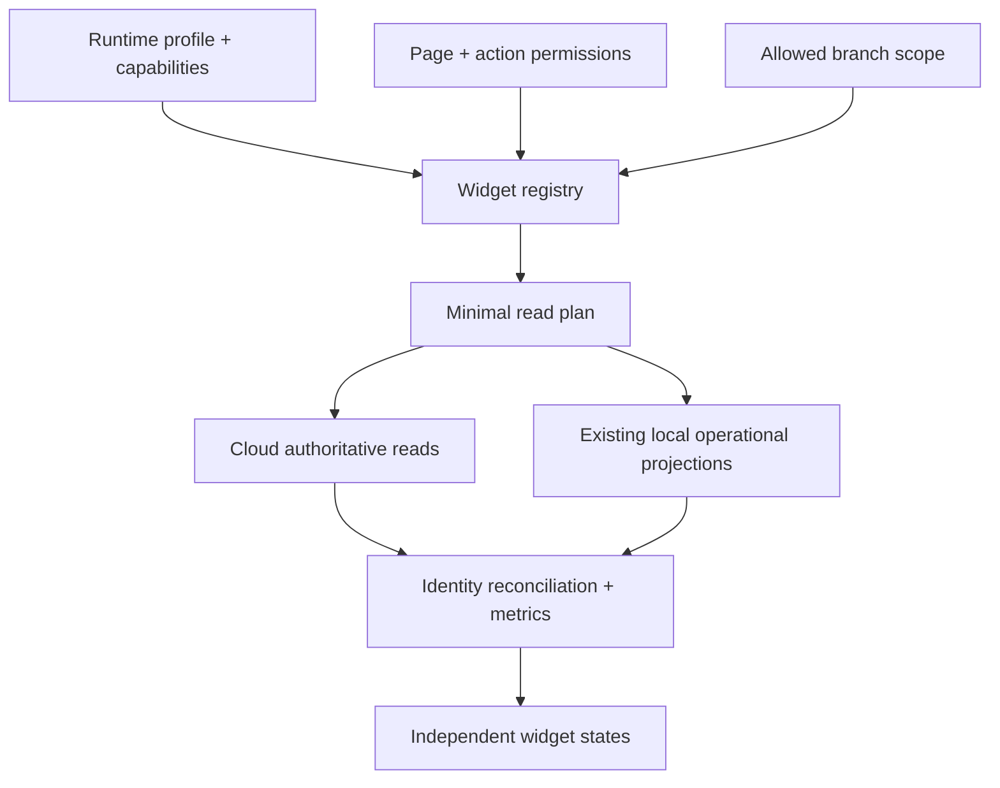

# Sharawla Universal Dashboard V1 — Architecture

Status: source-only implementation. No deployment or database change is part of this work.

## Baseline and integration scope

Dashboard V1 was originally implemented from `08348a930085d7b3f8b6cb6de27c7ac67ffc9a5e` in commit `de203e0d7531475341653be18fb9fd91d0642695`. Phase 2 fetched the actual current `rc1-beta58-32-performance-hotfix` head, `22d707eef8f3dbb6dc9a47686463fb4ed8392520`, and created `feature/universal-dashboard-v1-current-rc1` from that current head.

The current RC1 head is ten commits ahead of the original Dashboard baseline. Those commits close and test newer Bon numbering, reservation, business-date, and source-chain work. They are authoritative and are not modified by Dashboard V1. The integration ports only the Dashboard delta; it does not merge or cherry-pick the older feature branch wholesale. No merge into RC1 is included.

The audit covered the runtime/capability chain, all seven active profile engines, navigation, legacy reports, Reports V2, Permissions V2, operational Offline V2 projections, inventory/purchasing owners, and specialization SQL/source modules.

### Profiles discovered

| Profile | Registry state | Dashboard interpretation |
|---|---|---|
| restaurant | implemented, active | common commerce plus restaurant operations/food capabilities |
| retail | implemented, active | common commerce plus retail inventory/purchasing |
| pharmacy | implemented, active | common commerce plus batch/expiry; no profit claim |
| service | implemented, active | jobs and appointments; no fabricated commerce summary |
| warehouse | implemented, active | stock/purchasing/central supply where enabled |
| membership | implemented, active | subscriptions and check-ins |
| logistics | implemented, active | shipments and operational statuses |
| general | not implemented, inactive | fail closed; no profile-specific fallback |

### Capability catalog discovered

Capability V3 exposes 107 codes across these domains:

- Core (14): auth, licensing, branches, users, permissions, customers, shifts, payments, expenses, reports, audit, notifications, offline, updates.
- Commerce (24): POS, orders, products, barcode, promotions, returns, website, delivery, pickup, variants, custom orders, price tiers, gift cards, loyalty, installments, trade-in, consignment, B2B orders, quotations, return policies, weight sales, bundles/kits, B2B portal, season pricing.
- Inventory (16): stock, count, transfers, suppliers, receiving, purchasing, multi-warehouse, batch, expiry, serials, purchase orders, supplier returns, replenishment, landed cost, returnables, testers.
- Food Service (9): kitchen, modifiers, tables, recipes, ingredients, prep, production, waste, costing.
- Pharmacy (6): catalog, prescriptions, controlled drugs, alternatives, insurance, claims.
- Logistics (9): shipments, waybills, pickup requests, zones/pricing, drivers, tracking, COD, client settlements, returns.
- Membership (9): members, plans, subscriptions, renewals, check-in, classes, bookings, freeze, trainers.
- Service (6): jobs, appointments, assets, warranty, packages, installation.
- Finance (5), Fiscal (2), Automotive (3), Healthcare (2), Education (1), and Delivery Integrations (1).

The legacy module-to-feature bridge recognizes `pos`, `customers`, `inventory`, `returns`, `reports`, `expenses`, `barcode`, `delivery`, `pickup`, `website`, `promocodes`, `restaurant`, `pharmacy`, and `insurance`. The declarative runtime module registry currently owns `food.recipe.runtime`, `food.recipe.ui`, and `food.advanced.ui`. Dashboard visibility uses resolved feature codes rather than module names.

## Engine shape

`universal-dashboard-engine-v1.js` is a pure UMD/CommonJS module. It contains no network or DOM access and owns:

- the declarative widget registry;
- profile, capability, permission, branch, and connectivity resolution;
- device-local period boundaries;
- field-aware Cloud/local identity reconciliation;
- the audited commerce formulas;
- request-generation guards and explicit data states.

`universal-dashboard-v1.js` owns presentation and bounded reads. `app.js` exposes a frozen read-only host adapter instead of exposing session credentials or mutable application state. The existing `home` route delegates to the dashboard and retains the prior home screen as a fail-safe fallback if the dashboard asset is unavailable.

## Data authority

- Online: Cloud tables protected by existing RLS and branch access are the global/central authority.
- Offline: `__SharawlaBeta554RuntimeRecovery.readOperationalRows` remains the local operational authority adapter. The dashboard creates no new outbox, cache, projection, or ownership route.
- An offline view is always current-branch only and is labeled `LOCAL / OFFLINE`. It is never described as centrally confirmed.
- Cloud-only widgets remain visibly unavailable offline. Zero is emitted only after a successful read and calculation.

## Query and performance contract

The UI resolves authorization and capabilities before constructing its read plan. Financial tables are not requested for a user without the existing `reports` permission. Reads are:

- filtered by allowed branch IDs and selected period at the server;
- limited to required columns;
- paged with a hard maximum of 5,000 rows per resource;
- cached for 30 seconds by table/query;
- cancelled with `AbortController` on a new filter request;
- protected by a generation token so stale responses cannot render;
- loaded with `Promise.allSettled` so secondary failures remain isolated.

Item/payment detail fan-out is limited to 300 parent documents and chunks of 150 IDs. Above the safe limit the affected widget is marked unavailable and explicitly requests a future aggregated read model; data is never silently truncated.

There is no polling, `MutationObserver`, full-table unscoped commerce download, or per-row N+1 query.

## Time boundaries

V1 intentionally follows the existing POS reports behavior: date inputs are interpreted in the device's local timezone and then converted to ISO instants. The repository has no single authoritative business/branch timezone contract shared by all profiles. Therefore:

The newer RC1 `business_date` work is scoped to Bon numbering/reset policy. Repository evidence does not establish it as a universal Dashboard reporting timezone contract, so Dashboard V1 deliberately does not reuse it.

- Today, Yesterday, This week, This month, and Custom are supported.
- Week starts Monday.
- Previous-period comparison is disabled and explains why.
- A future comparison must first establish an authoritative business/branch timezone and DST boundary contract.

## Security boundary

Dashboard authorization is additive to existing RLS, never a replacement:

1. `canAccessPage` and the profile engine determine page permissions.
2. `allowedBranchIds` constrains every branch selector and query.
3. Exact Permissions V2 actions are evaluated before specialized reads; V1 uses `inventory.supply.view` for Central Warehouse.
4. Server RLS/RPC checks remain the final enforcement layer.

The dashboard host only exposes read methods. The dashboard source contains no POST, PATCH, PUT, or DELETE operation.

## Failure model

Every registry entry resolves to one of: `loading`, `ready`, `empty`, `error`, `no_permission`, `capability_unavailable`, `offline_unavailable`, or `unsupported`.

Unauthorized and non-applicable widgets are omitted. Cloud-only widgets can remain present offline with an unavailable state. A failed inventory or employee request does not erase a valid sales summary. A failed returns source prevents net sales from being shown as a believable zero.

## Extension contract

New widgets are added by declaring profile/capability/permission/data requirements in `WIDGETS`, then adding one bounded loader and renderer. A new business profile does not require a duplicated dashboard. A widget must not be registered as ready until its authoritative source and formula are documented in the data map.

## Explicit non-goals

- No profit/COGS card.
- No stock valuation card.
- No new SQL object or deployed read model.
- No changes to Point 4, Canonical Stock/Cutover, Offline V2 ownership, Bon numbering, printing, activation, licensing, updater, device identity, or Business Connection.
